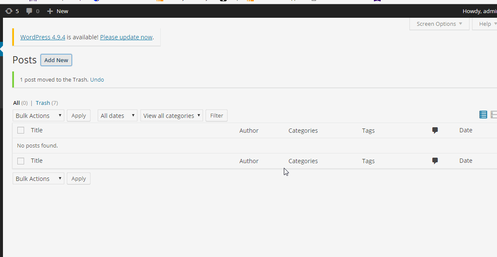

# Project 7 - WordPress Pentesting

Time spent: 9 hours spent in total

> Objective: Find, analyze, recreate, and document **Three vulnerabilities** affecting an old version of WordPress

## Pentesting Report

1. (Required) Vulnerability Name or ID
  - [ ] Summary: 
    - Vulnerability types: XSS
    - Tested in version: 4.0
    - Fixed in version: 4.2.3
  - [ ] GIF Walkthrough: 
  - [ ] Steps to recreate: create a new post, and paste <a href="[caption code=">]</a><a title="  onmouseover=alert('hello')  ">link</a> into text entry. Finally, go to Preview.
  - [ ] Affected source code:
    - [Link 1](https://core.trac.wordpress.org/changeset/33359)
2. (Required) Vulnerability Name or ID
  - [ ] Summary: 
    - Vulnerability types: XSS
    - Tested in version: 4.0 
    - Fixed in version: 4.7.3
  - [ ] GIF Walkthrough: 
  - [ ] Steps to recreate: create a new post, paste [embed src='https://youtube.com/embed/second\x3csvg onload=alert(1)\x3e'][/embed] into text entry, then go to preview.
  - [ ] Affected source code:
    - [Link 1](https://github.com/WordPress/WordPress/commit/419c8d97ce8df7d5004ee0b566bc5e095f0a6ca8)
3. (Required) Vulnerability Name or ID
  - [ ] Summary: 
    - Vulnerability types: XSS
    - Tested in version: 4.0
    - Fixed in version: 4.2.10
  - [ ] GIF Walkthrough: 
  - [ ] Steps to recreate: post a image, then change the title of image with "examplePicture.jpg", then click view attachment page.
  - [ ] Affected source code:
    - [Link 1](https://github.com/WordPress/WordPress/commit/c9e60dab176635d4bfaaf431c0ea891e4726d6e0)

## Assets

List any additional assets, such as scripts or files

## Resources

- [WordPress Source Browser](https://core.trac.wordpress.org/browser/)
- [WordPress Developer Reference](https://developer.wordpress.org/reference/)

GIFs created with [LiceCap](http://www.cockos.com/licecap/).

## Notes

Most vulnerabilities are based on XSS, which is not easy to me.

## License

    Copyright [2018] [Xiaohang Zou]

    Licensed under the Apache License, Version 2.0 (the "License");
    you may not use this file except in compliance with the License.
    You may obtain a copy of the License at

        http://www.apache.org/licenses/LICENSE-2.0

    Unless required by applicable law or agreed to in writing, software
    distributed under the License is distributed on an "AS IS" BASIS,
    WITHOUT WARRANTIES OR CONDITIONS OF ANY KIND, either express or implied.
    See the License for the specific language governing permissions and
    limitations under the License.
